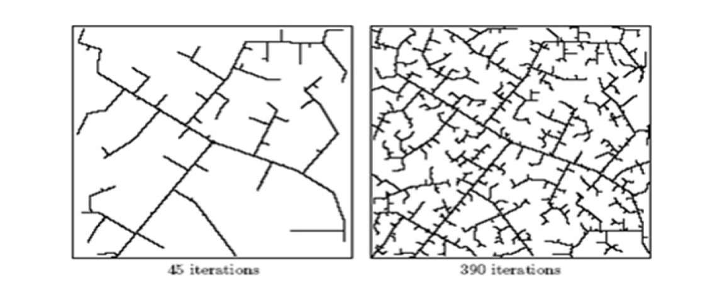
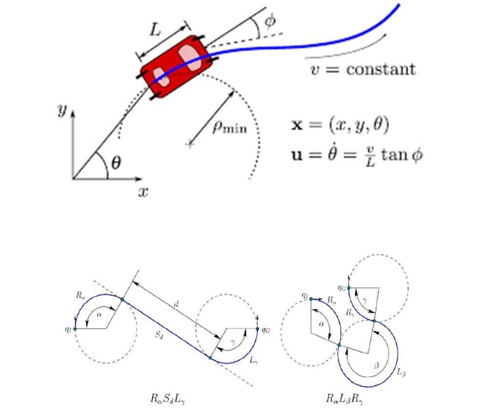
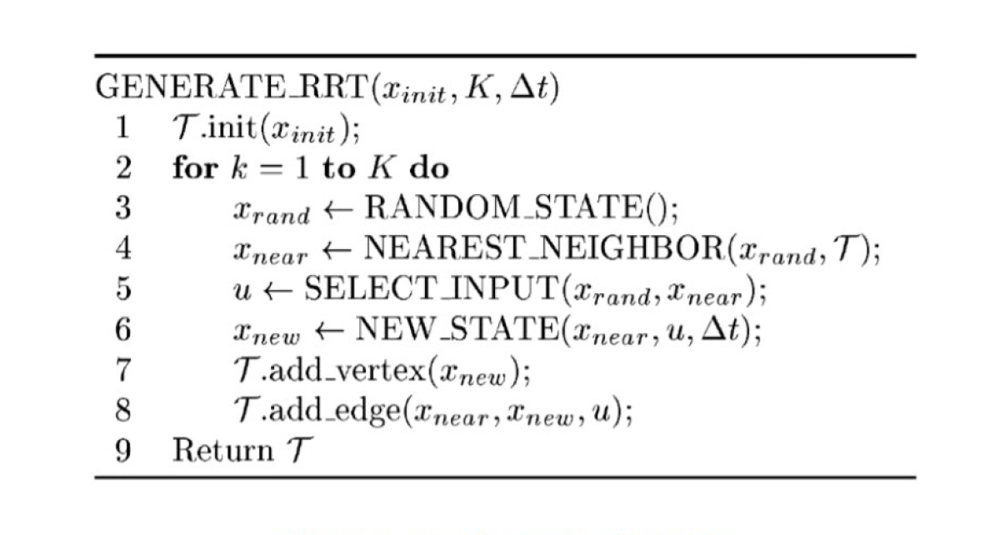

# Motion Planning
Motion Planning includes state-of-the art techniques and algorithms in AI with a focus on robotics and computer graphics.This repository consists of 4 different assignments making use of different algorithms and a final project which has been described below:-

# Final Project:Non-Holonomic Planning of a Car
# Introduction
In this Project, we consider motion planning for a Non-Holonomic car (Dubin’s Car)
using RRT Algorithm. The objective is to develop and implement a path planning
system that can be used for a car to move from an initial configuration to a goal
configuration. Non-Holonomic Planning means planning with some differential
constraints. The constraint in our case is that the car can only move in forward direction
with constant velocity.

# Methodology
After assessing various algorithms available for non-holonomic planning, we decided to
implement a Rapidly Exploring Random Tree Algorithm (RRT) with a Dubin’s car
model to implement this project.

# RRT

RRT is a Sampling-based motion planning approach which was introduced by LaValle
and Kuffner in 1998. RRT is an algorithm which performs incremental sampling and
searching and is mostly appropriate for single query problems. RRT is probabilistically
complete and has a perfect balance between greedy search and exploration. RRT is
constructed incrementally in a way that quickly reduces the expected distance of a
randomly chosen point to the tree. RRT is particularly suited for path planning
problems that involve obstacles and differential constraints. Usually, an RRT alone is
insufficient to solve a planning problem. Thus, it can be considered as a component that
can be incorporated into the development of a variety of different planning algorithms.

# Dubin's Car

Dubin’s Car was introduced by a famous mathematician and statistician Lester Dubin in the year 1957.It is a simplified mathematical model of a car that moves in the x and y plane. The car's location is specified by the location of the center of the car's rear axle and the orientation of the car. The car cannot move sideways because the rear wheels would have to slide instead of roll. The Dubin’s car model stipulates that the car moves forward at a constant speed and has a maximum steering angle that translates into a minimum turning radius. Dubin’s Car can only move forward and not backwards with constant velocity as 1 m/s. The car can only have three controls which are Turn Right at maximum, Turn Left at maximum and Go Straight.

# Pseudo Code
There are many ways in which we can implement the local planner in our RRT algorithm such as defining six scenarios for the Dubin’s car which include {RSR,LSL,RSL,LSR,RLR AND LRL} and select the optimal scenario to traverse the path or apply random controls (or a sequence of random controls ) for a fixed amount of time and select the control that leads you closest to the random configuration. In our Implementation, we have defined three controls (Left, Straight, Right) which are applied for a fixed amount of time and selected the control which has the minimum distance to the random configuration.

# Future Work
RRT can help us find out the feasible path for the car to travel and not the optimal path. RRT Algorithm also cannot incorporate additional cost information such as smoothness or length of the path to solve a path planning problem. For this reason, it is desirable to use variants of the RRT that converges to the optimum path such as RRT* to make it more dynamic. The use of Dubin’s cars as model to represent a non-holonomic vehicle model is seen to be restrictive and a misrepresentation of an actual car model. Relaxing the vehicle path constraints by using a Smooth Car model would be necessary to find a more optimal path.

